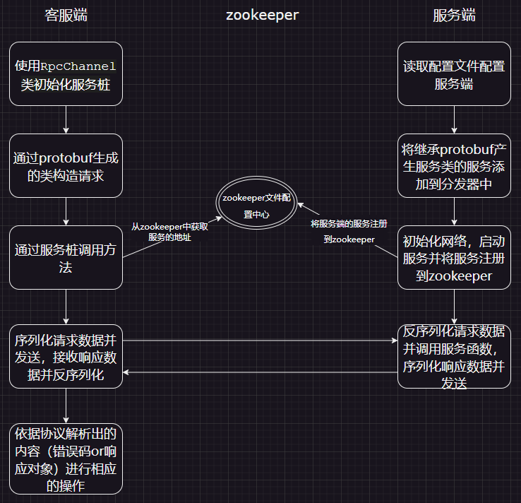
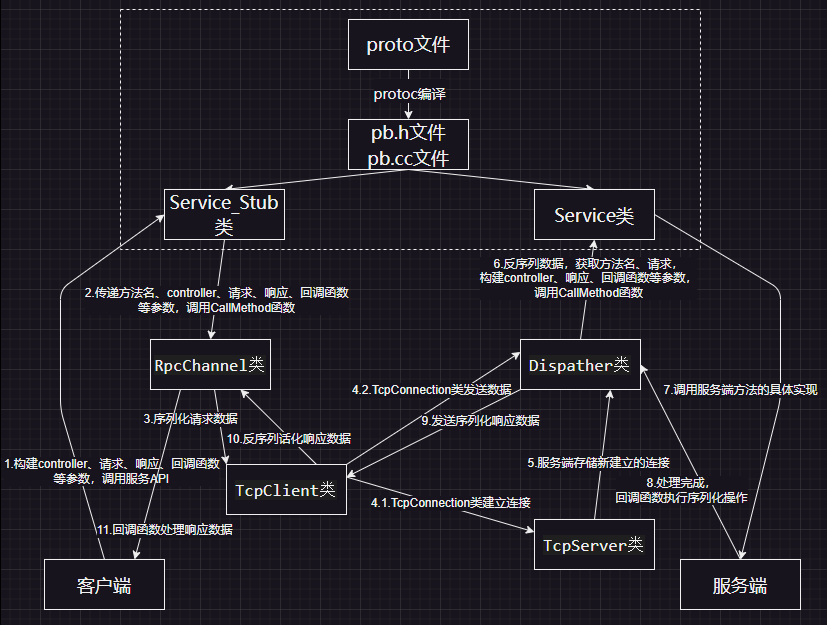

# A C++ Light Remote Procedure Call（LightRPC）

本项目为C++11编写的小型远程调用框架：

* 基于**主从Reactor架构**，多线程并发处理，底层采用**epoll**实现IO多路复用；
* 使用**http协议**和**自定义的tinyrpc协议**通过**protobuf**进行通信；
* 通过**zookeeper**实现服务发现；
* 提供**xml**配置模块，启动时自加载配置文件；
* 异步线程负责输出日志，日志支持按日期、大小滚动；
* 开箱即用，通过接口实现业务开发，无需关注底层框架逻辑；

## 目录

|      Part Ⅰ      |      Part Ⅱ      |      Part Ⅲ      |          Part Ⅳ          |        Part Ⅴ        |
| :----------------: | :----------------: | :----------------: | :------------------------: | :--------------------: |
| [环境配置](#环境配置) | [前置知识](#前置知识) | [整体概览](#整体概览) | [部分模块介绍](#部分模块介绍) | [框架的使用](#框架的使用) |

## 环境配置

本项目使用了智能指针，如std::make_unique，还有其他一些C++新特性，本项目的环境部署在腾讯云，使用版本如下：

1. 服务端环境：
   * C++17及以上
   * ubuntu 20.04，CPU 2核 - 内存 2GB
2. 依赖库安装：
   1. protobuf：要求版本3.19.4以上，[protobuf安装](https://zhuanlan.zhihu.com/p/631291781)，安装到/usr/local目录
   2. tinyxml：
      要生成 libtinyxml.a 静态库，需要简单修改 makefile 如下:

      ```
      # 84 行修改为如下
      OUTPUT := libtinyxml.a

      # 93 行修改为如下
      SRCS := tinyxml.cpp tinyxmlparser.cpp tinyxmlerror.cpp tinystr.cpp 

      # 注释掉129行# 93 行xmltest.o: tinyxml.h tinystr.h

      # 104行修改如下
      ${OUTPUT}: ${OBJS}
          ${AR} $@ ${LDFLAGS} ${OBJS} ${LIBS} ${EXTRA_LIBS}
      ```

      安装过程如下：

      ```
      wget https://udomain.dl.sourceforge.net/project/tinyxml/tinyxml/2.6.2/tinyxml_2_6_2.zip

      unzip tinyxml_2_6_2.zip

      cd tinyxml
      make -j4

      # copy 库文件到系统库文件搜索路径下
      cp libtinyxml.a /usr/lib/

      # copy 头文件到系统头文件搜索路径下 
      mkdir /usr/include/tinyxml
      cp *.h /usr/include/tinyxml
      ```
   3. zookeeper：

      1. 安装zookeeper之前需要安装java（[JAVA安装](https://blog.csdn.net/qq_43329216/article/details/118385502)）；
      2. [Linux下 zookeeper 的安装](https://blog.csdn.net/shenmingxueIT/article/details/115755444?ops_request_misc=%257B%2522request%255Fid%2522%253A%2522169865410516800226512242%2522%252C%2522scm%2522%253A%252220140713.130102334.pc%255Fblog.%2522%257D&request_id=169865410516800226512242&biz_id=0&utm_medium=distribute.pc_search_result.none-task-blog-2~blog~first_rank_ecpm_v1~rank_v31_ecpm-4-115755444-null-null.nonecase&utm_term=zookeeper&spm=1018.2226.3001.4450)；
      3. 可能出现的报错（[Linux安装zookeeper原生C API接口出现的make编译错误](https://blog.csdn.net/weixin_43604792/article/details/103879578)）；

## 前置知识

**Reactor模式、RPC、Protobuf、zookeeper**

## 整体概览

**整体流程：**



**RPC客户端与服务端通信整体框架：**



## 部分模块介绍

### 日志模块

* **异步日志** ：日志异步打印，不阻塞当前线程。生产者只需要将日志信息放入buffer即可，消费者线程会按照一定时间频率自动将日志同步到磁盘文件中。
* **日志级别** ：日志分级别打印， **当配置设定的级别高于待打印日志的级别时，日志打印是个空操作** ，无性能消耗。
* **文件输出** ：依据选择，日志支持可以输出到文件或者控制台中。
* **滚动日志** ：日志文件会自行滚动，当**跨天**或者**单个文件超过一定大小**后，会自动建立新的文件写入日志信息。
* **崩溃处理** ：通过设置信号处理函数，日志库处理了**程序突然崩溃**的情况，即当程序崩溃退出前先将日志信息同步到磁盘文件上，便于排查具体原因。
* **日志分类** ： 提供了两类日志类型，**RPC 框架日志**以及  **APP 应用日志** 。RPC 框架日志以 rpc 后缀结尾，是 RPC 框架在运行中打印的日志信息，通常用来监控框架本身的运行状态。APP 应用日志以 **app** 后缀结尾 专门用来处理用户请求，对于每一个客户端请求，APP 日志会打印出请求的 msg 作为标识。总的来说，如果只是使用 RPC，关注APP日志即可。
* **日志格式**：

  ```
     [Level][%y-%m-%d %H:%M:%s.%ms]\t[pid:thread_id]\t[file_name:line][%msg]
  ```

### Reactor模块

使用**Reactor模型** ，基本框架为 **多Reactor多线程** ，也即**muduo**中的 **One loop per thread** ：主线程中的**mainReactor**负责新连接的建立，收到事件通知后通过Accpetor对象建立新连接并分配给某个子线程，子线程中的**subReactor**对加入的新连接进行事件的监听并通过设置的回调函数进行处理。

### 定时器

基于**timerfd**构建定时器，timerfd使用内核提供的异步I/O机制，可以将定时器超时事件通知给应用程序，而不需要应用程序不断地轮询，设置超时时间之后，每隔一段时间 timerfd 就是可读的。**统一事件源**，定时器事件也注册到epoll_wait，将定时器信号添加到主线程的监听中，定时信号定时触发发事件，回调函数删除超时的非活动连接。

### 协议模块

TinyPB协议类、HTTP协议类继承AbstractProtocol类。

RPC框架保证一对RPC其请求体的msgid和返回体的msgid的一致性：

* 可以保证客户端假设发出了多个 RPC 请求后，收到多个回包，无法跟请求对应起来的疑惑。
* msgid 具有传递性，例如服务 A ->B->C， 可以将最初请求的 msgid一路透传下去，msgid 可以保证消息的跟踪。

```
struct AbstractProtocol : public std::enable_shared_from_this<AbstractProtocol> {
 public:
  typedef std::shared_ptr<AbstractProtocol> s_ptr;

  virtual ~AbstractProtocol() {}

 public:
  std::string m_msg_id_;      // 消息号，唯一标识一个请求或者响应
  ProtocalType protocol_;     // 协议
  HttpType http_type_;        // http请求类型
};
```

#### TinyPB协议：

TinyPB 协议是基于 protobuf 的一种自定义协议，主要是加了一些必要的字段如错误码、RPC 方法名、起始结束标志位。TinyPb 协议里面所有的 int 类型的字段在编码时都会先转为网络字节序。

| 报文开始 | 整个报文的长度 | 报文id长度    | 报文id    | 方法名长度         |     方法名     | 框架级错误代码 | 错误信息长度    | 错误信息    | 业务 protobuf 数据 | 包校验和     | 报文结束 |
| :-------: | :------------: | ------------- | --------- | ------------------ | :------------: | :------------: | --------------- | ----------- | :----------------: | ------------ | -------- |
| PB_START_ |   m_pk_len_   | m_msg_id_len_ | m_msg_id_ | m_method_name_len_ | m_method_name_ |  m_err_code_  | m_err_info_len_ | m_err_info_ |     m_pb_data_     | m_check_sum_ | PB_END_  |

```
struct TinyPBProtocol : public AbstractProtocol {
 public:
  TinyPBProtocol(){}
  ~TinyPBProtocol() {}

  // 对响应信息设置错误码
  void SetTinyPBError(int32_t err_code, const std::string err_info);

 public:
  static char PB_START_;             // 报文的开始
  static char PB_END_;               // 报文的结束

 public:
  int32_t m_pk_len_ {0};             // 整个报文长度，单位为byte，且包括 [strat] 字符 和 [end] 字符。
  int32_t m_msg_id_len_ {0};         // 请求号的长度
  // msg_id 继承父类

  int32_t m_method_name_len_ {0};    // 方法名字长度
  std::string m_method_name_;        // 方法名
  int32_t m_err_code_ {0};           // 框架级错误代码. 0 代表调用正常，非 0 代表调用失败，代表调用 RPC 过程中发生的错误，如对端关闭、调用超时等。
  int32_t m_err_info_len_ {0};       // err_info 长度
  std::string m_err_info_;           // 详细错误信息， err_code 非0时会设置该字段值
  std::string m_pb_data_;            // 业务 protobuf 数据，由 google 的 protobuf 序列化后得到
  int32_t m_check_sum_ {0};          // 包检验和，用于检验包数据是否有损坏

  bool parse_success_ {false};       // 解析是否成功
};
```

#### HTTP协议：

**请求**：

* 消息ID放在请求头中，请求头中的类型设置为"application/lightrpc"；
* 若为GET请求，则将请求的内容序列化后与请求地址进行拼接，格式为**localhost:80/服务名/方法名?序列化的请求内容**；若为POST请求，则将请求的内容序列化后放在请求体中；

**响应**：

* 消息ID放在响应头中，响应头中的类型设置为"application/lightrpc"；
* 响应的内容序列化后放在响应体中；

```


class HttpRequest : public AbstractProtocol {
public:
    typedef std::shared_ptr<HttpRequest> ptr; 

public:
    HttpMethod m_request_method_;       // 请求的方法 
    std::string m_request_path_;        // 请求行请求的路径
    std::string m_request_query_;       // 请求内容
    std::string m_request_version_;     // 请求的http版本
    HttpHeaderComm m_header_;  // 请求头
    std::string m_body_;        // 请求体

    std::map<std::string, std::string> m_query_maps_;
};

class HttpResponse : public AbstractProtocol {
public:
    typedef std::shared_ptr<HttpResponse> ptr; 

public:
    std::string m_response_version_;    // 响应版本
    int m_response_code_;               // 响应码
    std::string m_response_info_;       // 响应消息
    HttpHeaderComm m_header_;  // 响应头
    std::string m_body_;       // 响应体
};

```

### zookeeper模块

Zookeeper是一个分布式的、开源的应用程序的协调服务。本框架使用zookeeper来实现服务发现，zookeeper在这里起到一个配置中心的作用。

服务端创建服务并将服务注册到zookeeper，zookeeper上面标识了每个类的方法所对应的**分布式节点地址，**当我们其他服务器想要RPC的时候，就去 zookeeper 上面查询对应要调用的服务在哪个节点上**。**

```
class ZookeeperClient
{
public:
    ZookeeperClient();
    ~ZookeeperClient();

    //启动连接--》zkserver
    void start(lightrpc::NetAddr::s_ptr zookeeper_addr);
    //在zkserver 根据指定的path创建znode节点
    void create(const char *path, const char *data, int datalen, int state = 0);
    //根据参数指定的znode节点路径，获取znode节点的值
    std::string get_data(const char *path);

private:
    //zk的客户端句柄
    zhandle_t *zhandle_;
};
```

## 框架的使用

### 1.框架的生成及项目目录结构

```
运行make.sh
// 3.1.运行服务端测试
bin目录里面服务端对应的可执行文件
// 3.2.运行客户端测试
bin目录里面客户端对应的可执行文件
// 4.测试通过后进行安装（默认会在 /usr/lib 路径下安装 liblightrpc.a 静态库文件，以及在 /usr/include/lightrpc 下安装所有的头文件。）
make install
// 5.卸载
make uninstallW
```


```
LightRPC
├─ README.md
├─ bin				// 测试用的可执行文件
│  ├─ test_rpc_client
│  └─ test_rpc_server
├─ conf				// 配置文件目录
│  ├─ lightrpc.xml
│  └─ lightrpc_client.xml
├─ image			// 存储README.md文件中的图片
│  ├─ README
│  │  ├─ 1700660750094.png
│  │  └─ 1700668167972.png
│  ├─ flowchart.drawio
│  └─ framework.drawio
├─ lib				// 存储库文件
│  └─ liblightrpc.a
├─ lightrpc			// 框架具体代码
│  ├─ common			// 配置读取、日志输出、消息号等
│  │  ├─ config.cc
│  │  ├─ config.h
│  │  ├─ error_code.h
│  │  ├─ exception.h
│  │  ├─ log.cc
│  │  ├─ log.h
│  │  ├─ msg_id_util.cc
│  │  ├─ msg_id_util.h
│  │  ├─ util.cc
│  │  └─ util.h
│  └─ net			// 网络部分
│     ├─ eventloop.cc
│     ├─ eventloop.h
│     ├─ fd_event.cc
│     ├─ fd_event.h
│     ├─ http			// HTTP协议模块
│     │  ├─ http_codec.cc
│     │  ├─ http_codec.h
│     │  ├─ http_protocol.cc
│     │  └─ http_protocol.h
│     ├─ io_thread.cc
│     ├─ io_thread.h
│     ├─ io_thread_pool.cc
│     ├─ io_thread_pool.h
│     ├─ rpc			// RPC模块
│     │  ├─ abstract_codec.h
│     │  ├─ abstract_protocol.h
│     │  ├─ rpc_channel.cc
│     │  ├─ rpc_channel.h
│     │  ├─ rpc_closure.h
│     │  ├─ rpc_controller.cc
│     │  ├─ rpc_controller.h
│     │  ├─ rpc_dispatcher.cc
│     │  ├─ rpc_dispatcher.h
│     │  ├─ rpc_interface.cc
│     │  ├─ rpc_interface.h
│     │  ├─ string_codec.h
│     │  ├─ zookeeper_client.cc
│     │  └─ zookeeper_client.h
│     ├─ tcp			// TCP模块
│     │  ├─ net_addr.cc
│     │  ├─ net_addr.h
│     │  ├─ tcp_acceptor.cc
│     │  ├─ tcp_acceptor.h
│     │  ├─ tcp_buffer.cc
│     │  ├─ tcp_buffer.h
│     │  ├─ tcp_client.cc
│     │  ├─ tcp_client.h
│     │  ├─ tcp_connection.cc
│     │  ├─ tcp_connection.h
│     │  ├─ tcp_server.cc
│     │  └─ tcp_server.h
│     ├─ timer.cc
│     ├─ timer.h
│     ├─ timer_event.cc
│     ├─ timer_event.h
│     ├─ tinypb			// TinyPB协议模块
│     │  ├─ tinypb_codec.cc
│     │  ├─ tinypb_codec.h
│     │  ├─ tinypb_protocol.cc
│     │  └─ tinypb_protocol.h
│     ├─ wakeup_fd_event.cc
│     └─ wakeup_fd_event.h
├─ log				// 存储日志文件
├─ make.sh
├─ makefile
├─ obj				// 库文件目录，存放编译过程的中间产物
│  ├─ config.o
│  ├─ eventloop.o
│  ├─ fd_event.o
│  ├─ http_codec.o
│  ├─ http_protocol.o
│  ├─ io_thread.o
│  ├─ io_thread_pool.o
│  ├─ liblightrpc.a
│  ├─ log.o
│  ├─ msg_id_util.o
│  ├─ net_addr.o
│  ├─ rpc_channel.o
│  ├─ rpc_controller.o
│  ├─ rpc_dispatcher.o
│  ├─ rpc_interface.o
│  ├─ tcp_acceptor.o
│  ├─ tcp_buffer.o
│  ├─ tcp_client.o
│  ├─ tcp_connection.o
│  ├─ tcp_server.o
│  ├─ timer.o
│  ├─ timer_event.o
│  ├─ tinypb_codec.o
│  ├─ tinypb_protocol.o
│  ├─ util.o
│  ├─ wakeup_fd_event.o
│  └─ zookeeper_client.o
└─ testcases			// 测试代码
   ├─ order.pb.cc
   ├─ order.pb.h
   ├─ order.proto
   ├─ orderimpl.h
   ├─ test_rpc_client.cc
   └─ test_rpc_server.cc

```


### 2.准备proto文件

```
syntax = "proto3";
option cc_generic_services = true;

message makeOrderRequest {
  int32 price = 1;
  string goods = 2;
}

message makeOrderResponse {
  int32 ret_code = 1;
  string res_info = 2;
  string order_id = 3;
}

service Order {
  rpc makeOrder(makeOrderRequest) returns (makeOrderResponse);
}
```

这里只是实例，实际的 proto 文件是根据具体的业务逻辑来设计的，简单来说就是根据 RPC 服务的业务行为，设计对应的接口、请求参数、返回参数，这里定义了要调用方法是属于哪个类的哪个方法以及这个方法所需要的的参数大小 。

```
// 生成C++代码
protoc --cpp_out=./ test_tinypb_server.proto
```

以上面的 `order.proto` 为例，本质上我们使用的其实是 `protoc` 生成的 `order.pb.h` 和 `order.pb.cc` 文件。 message xxx可以理解为 class 类，简单来说就是对一些变量进行封装，在 pb.h 会生成对应的 class 类。

在RPC请求包里面有个字段 method_name，即方法名。它实际上应该是 proto 文件里的 service.method， 例如 Order.makeOrder，就代表需要调用 Order 这个 Service 下的 makeOrder 方法。RPC 服务端收到请求后，而 OrderImpl 继承于 Order，并且重写了 makeOrder 方法，在重写的 makeOrder 方法里面调用到具体的 interface 下的接口。

### 2.客服端

* 通过RpcChannel类初始化桩类，RpcChannel类的初始化需要zookeeper的地址来进行服务发现；
* 依据proto文件生成的文件构建请求与响应；
* 通过RpcController来进行相关参数的设置，如信息号、连接时长、请求协议等；
* 设置回调函数对响应进行处理；
* 最后通过服务桩类进行方法的调用；

```
void test_rpc_channel() {
  NEWMESSAGE(makeOrderRequest, request);
  NEWMESSAGE(makeOrderResponse, response);
  // 获取服务端通信
  std::shared_ptr<lightrpc::RpcChannel> channel = std::make_shared<lightrpc::RpcChannel>(std::make_shared<lightrpc::IPNetAddr>("127.0.0.1:2181"));
  std::shared_ptr<Order_Stub> stub = std::make_shared<Order_Stub>(channel.get());
  // 请求与响应
  request->set_price(100);
  request->set_goods("apple");
  // 相关辅助参数设置
  NEWRPCCONTROLLER(controller);
  controller->SetMsgId("99998888");
  controller->SetTimeout(10000);
  // 设置http请求报文的相关参数
  controller->SetProtocol(lightrpc::ProtocalType::HTTP);
  controller->SetCallMethod(lightrpc::HttpMethod::GET);
  lightrpc::HttpHeaderComm http_header;
  http_header.SetKeyValue("Content-Type",lightrpc::content_type_lightrpc);
  http_header.SetKeyValue("Connection", "Keep-Alive");
  controller->SetHttpHeader(http_header);
  controller->SetHttpVersion("HTTP/1.1");
  // 回调函数设置
  std::shared_ptr<lightrpc::RpcClosure> closure = std::make_shared<lightrpc::RpcClosure>([request, response]() mutable {
    LOG_INFO("call rpc success, request[%s], response[%s]", request->ShortDebugString().c_str(), response->ShortDebugString().c_str());
    // 执行业务逻辑
    if (response->order_id() == "xxx") {
      // xx
    }
  });
  // 远程调用，可以通过controller来进行相关的控制（如连接超时时间、错误、调用完成。。。）
  stub->makeOrder(controller.get(), request.get(), response.get(), closure.get());
}
```

### 3.服务端

* 依据需求配置conf目录下的配置文件；
* 继承proto文件生成的C++类进行服务业务代码编写，每一个方法定义一个接口；
* 初始化日志和目录文件；
* 使用配置文件的参数对Tcp_Server进行初始化；
* 服务注册：
  * 当使用HTTP协议时，需要指定在RpcDispatcher类中通过函数RegisterServlet进行方法和路径的绑定，并进行注册；
  * 当使用TinyPB协议时，直接调用RpcDispatcher类中的函数RegisterService进行方法的注册，RegisterService函数中会按照（/服务名/方法名）的格式进行路径的构造；
* 最后启动服务；

```
class MakeOrderInterface : public lightrpc::RpcInterface{
public:
    MakeOrderInterface(const google::protobuf::Message* req, google::protobuf::Message* rsp, ::google::protobuf::Closure* done, google::protobuf::RpcController* controller):
    lightrpc::RpcInterface(req, rsp, done, controller){}

    void Run(){
        try {
            // 业务逻辑代码
            LOG_APPDEBUG("start sleep 5s");
            sleep(5);
            LOG_APPDEBUG("end sleep 5s");
            auto resquest = dynamic_cast<const makeOrderRequest*>(m_req_base_);
            auto response = dynamic_cast<makeOrderResponse*>(m_rsp_base_);
            if (resquest->price() < 10) {
                response->set_ret_code(-1);
                response->set_res_info("short balance");
                return;
            }
            response->set_order_id("20230514");
        }catch (lightrpc::LightrpcException& e) {
            LOG_APPERROR("LightrpcException exception[%s], deal handle", e.what());
            e.handle();
            SetError(e.errorCode(), e.errorInfo());
        } catch (std::exception& e) {
            LOG_APPERROR("std::exception[%s], deal handle", e.what());
            SetError(-1, "unkonwn std::exception");
        } catch (...) {
            LOG_APPERROR("Unkonwn exception, deal handle");
            SetError(-1, "unkonwn exception");
        }
    }

    void SetError(int code, const std::string& err_info){
        m_controller_->SetError(code, err_info);
    }
};

class OrderImpl : public Order {
 public:
  void makeOrder(google::protobuf::RpcController* controller,
                      const ::makeOrderRequest* request,
                      ::makeOrderResponse* response,
                      ::google::protobuf::Closure* done) {
    std::shared_ptr<MakeOrderInterface> impl = std::make_shared<MakeOrderInterface>(request, response, done, controller);
    impl->Run();
  }
};
```

```
int main(int argc, char* argv[]) {
  if (argc != 2) {
    printf("Start test_rpc_server error, argc not 2 \n");
    printf("Start like this: \n");
    printf("./test_rpc_server ../conf/lightrpc.xml \n");
    return 0;
  }

  // 初始化日志和配置文件
  lightrpc::Config::SetGlobalConfig(argv[1]);
  lightrpc::Logger::InitGlobalLogger();

  lightrpc::TcpServer tcp_server(lightrpc::Config::GetGlobalConfig()->m_rpc_stubs_["browser"].addr_, 
  lightrpc::Config::GetGlobalConfig()->m_rpc_zookeepers_["default"].addr_, 
  lightrpc::Config::GetGlobalConfig()->m_rpc_stubs_["browser"].protocal_, 
  lightrpc::Config::GetGlobalConfig()->m_rpc_stubs_["browser"].timeout_);
  // 依据配置文件中的服务的协议进行相关的操作
  std::shared_ptr<OrderImpl> service = std::make_shared<OrderImpl>();
  lightrpc::RpcDispatcher::GetRpcDispatcher()->RegisterService(service);

  tcp_server.Start();

```
